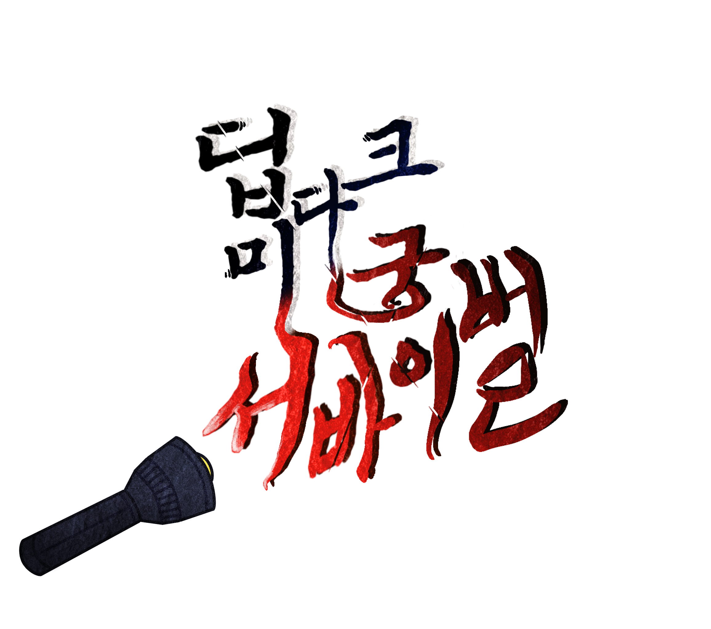

<h1>딥 다크 미궁 서바이벌</h1>  

<h2>2024 MDP 프로젝트</h2>  
<h3>유니티 VR 게임 개발</h3>  
<h4>조원: </h4>
<A href = "https://github.com/hyunjae0912" target = "링크 방법" > 유현재  </A> 
&emsp; 역할: 조장, 몬스터 개발, 게임 매니저 개발, 애니메이션 개발  
<A href = "https://github.com/leesh0829" target = "링크 방법" > 이승현 </A>
&emsp; 역할: 플레이어 개발, 맵 제작 및 디자인, UI개발, 악세서리 개발   
<h5>작품 설명:</h5>
<i>맨눈으로는 보이지 않는 어두운 미로에 갇히게 된 주인공,
가지고있는 손전등과 권총을 사용하여 갑자기 들이닫히는 정체불명의 괴물에게서 살아남아라!</i>  
<b>작품 설명 및 시연 영상 링크</b> 
<b>https://drive.google.com/file/d/11yYno_kA0mNxw_tFaETOEZDIdPyJiWHe/view?usp=drive_link</b>  
<b></b>게임 설치 파일</b>  
<b>작품 활동</b>
<h6>&#183;2024 인천전자마이스터고 IM 기술 명장 대전</h6>
<h6>&#183;2024 인천광역시 직업 교육 박람회</h6>
